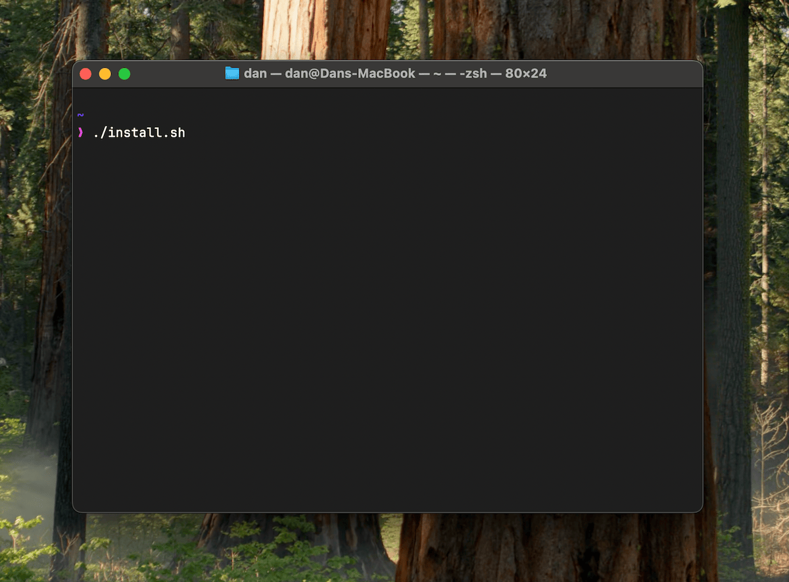

# Dotfiles

## What's included

- [Homebrew](https://brew.sh/)
- The latest Ruby managed by [rbenv](https://github.com/rbenv/rbenv)
- Gems for development: Rails, Bundler, CocoaPods, RuboCop, etc.
- Zsh with [Oh My Zsh](https://github.com/ohmyzsh/ohmyzsh)
- Common development dependencies: PostgreSQL, ImageMagick, ssh-copy-id
- Apps: [Visual Studio Code](https://code.visualstudio.com), [Paw](https://paw.cloud/), [Postgres.app](https://postgresapp.com/), and many other (customize in `Brewfile`)
- [Homebrew Fonts](https://github.com/Homebrew/homebrew-cask-fonts)
- SSH key generation

## Screenshot



## Install

```bash
# Install Xcode tools
xcode-select --install

# Clone dotfiles repo and change directory
git clone https://github.com/dankimio/dotfiles.git ~/Developer/dotfiles
cd ~/Developer/dotfiles

# Install using the script
./install.sh
```
